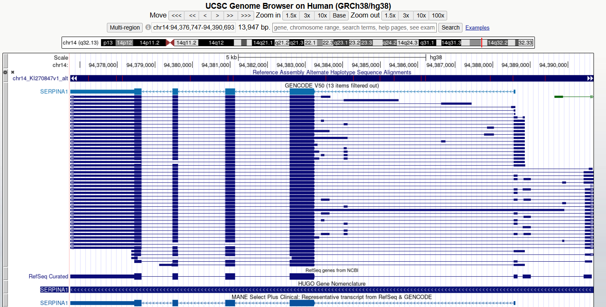
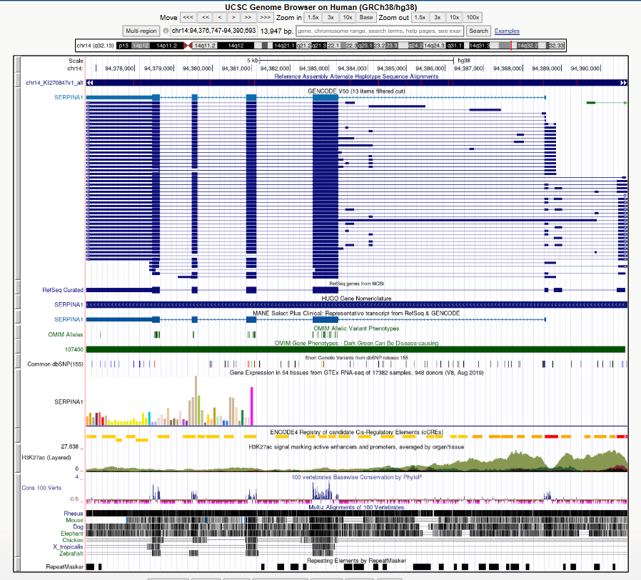
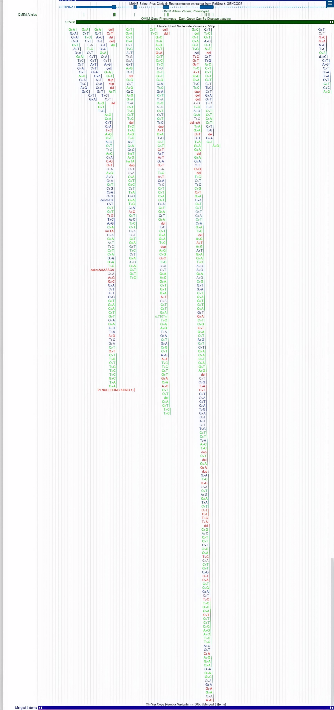
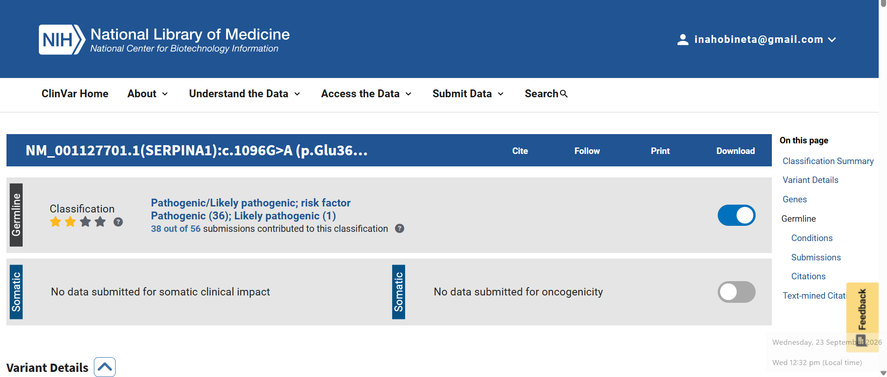
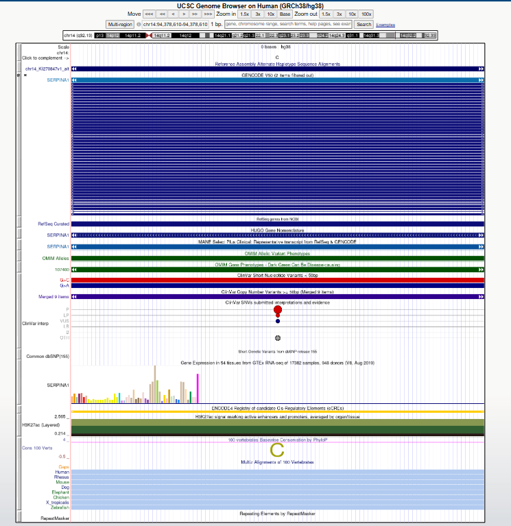

# OBINETA_SERPINA1_UCSC_Genome_Browser
UCSC Genome Browser &amp; ClinVar analysis of SERPINA1, the gene linked to Alpha-1 Antitrypsin Deficiency.

# Exploring a Human Disease Gene Using UCSC Genome Browser and NCBI ClinVar

**Name:** Obiñeta, Inah Marie

**Date Completed:** September 23, 2026

**Assigned Gene:** SERPINA1

**Associated Disease:** Alpha-1 Antitrypsin Deficiency (AATD)

---

## PART A. Create Your GitHub Activity Record

**GitHub Repository Link:**
[https://github.com/iinahmariee/OBINETA_SERPINA1_UCSC_Genome_Browser/tree/GROUP-4](https://github.com/iinahmariee/OBINETA_SERPINA1_UCSC_Genome_Browser/tree/GROUP-4)

---

## PART B. Locate Your Gene in the UCSC Genome Browser

| ITEM | ANSWER |
|---|---|
| a. Official gene symbol | SERPINA1 |
| b. Full gene name | Serpin Family A Member 1 (serpin peptidase inhibitor, clade A [alpha-1 antiproteinase, antitrypsin], member 1) |
| c. Chromosome | 14 |
| d. Assembly | GRCh38.p14 |
| e. Coordinates (GRCh38) | chr14:94,375,355–94,392,044 |
| f. Strand | − (minus strand) |
| g. Approximate size | 13.9 kb |

**Screenshot 1: Gene location in UCSC**

---

## PART C. Understand the Gene Structure: Exons, Introns, and Transcripts

**a. Number of exons you can identify in your selected transcript:**
I selected transcript ENST00000866537.2 (GENCODE V50), visible in the UCSC popup. The tooltip identified this as showing Intron 3 of 5, meaning the transcript has 5 total introns and 6 exons. However, I also checked another transcript, ENST00000866542.2, which UCSC reported as having 5 total exons/4 coding. This shows that exon count can differ between transcripts of the same gene.

**b. Whether multiple transcripts/isoforms are visible:**
Yes. The GENCODE V50 track shows dozens of stacked transcript rows for SERPINA1, indicating many alternative isoforms.

**c. In your own words, explain the difference between an exon and an intron:**
Exons are coding segments kept in the mature mRNA and translated into protein, while introns are non-coding segments spliced out before translation.

**d. Describe whether the introns generally appear longer or shorter than the exons in your gene:**
Introns appear longer than exons in SERPINA1. In the UCSC tooltip, Intron 3 alone measured 1,450 bp, while the exon boxes visible in the browser track are comparatively short and narrow. This matches the general pattern seen in most human genes, where large intron spacers separate relatively small coding exon blocks.

**Screenshot 2: Gene structure (exon boxes, intron connections, transcripts)**

---

## PART D. Turn On and Examine Genome Browser Tracks

**a. Which gene annotation track did you use?**
I used the GENCODE V50 track as my primary gene annotation track, and cross-checked it against RefSeq Curated and MANE Select Plus Clinical — all three consistently labeled the same gene region as SERPINA1.

**b. Were ClinVar-related variant marks visible within or near your gene?**
Yes. After setting the "ClinVar Short Nucleotide Variants < 50bp" track to pack mode and refreshing, numerous individual variants appeared clustered within the gene body, each labeled with its specific nucleotide substitution (e.g., G>A, C>G, A>T, T>C). This is consistent with SERPINA1 being a well-studied, clinically significant gene.

**c. Were some regions more conserved than others?**
Yes. The "100 vertebrates Basewise Conservation by PhyloP" track showed conservation signal that was not uniform across the gene — instead, it appeared as a series of distinct peaks at specific positions, rather than a flat, even level of conservation throughout.

**d. Did conserved regions correspond mainly to exons, introns, both, or another region?**
The conservation peaks appeared to align primarily with the exon boxes in the gene model directly above the track, rather than the intronic connecting regions, consistent with the expectation that protein-coding sequence tends to be under stronger evolutionary constraint than non-coding intron sequence.

**e. In 2-3 sentences, explain why strong conservation can suggest biological importance.**
When a DNA sequence stays nearly identical across species over millions of years, it indicates purifying selection, where harmful mutations in vital regions are continuously removed. This high level of sequence conservation strongly suggests that the region plays a crucial functional role, such as in protein-coding exons or regulatory elements.

**Screenshot 3: Gene with at least one additional track (ClinVar)**

---

## PART E. Select One Variant in NCBI ClinVar

| ITEM | ANSWER |
|---|---|
| Gene | SERPINA1 |
| Variant / HGVS | NM_000295.4(SERPINA1):c.1096G>A (p.Glu366Lys) |
| Common name | "Z allele" / Pi*Z |
| rsID (dbSNP) | rs28929474 |
| GRCh38 position | chr14:94,378,610 |
| Condition | Alpha-1-antitrypsin deficiency (also reported with COPD/emphysema risk) |
| Clinical significance | Reported in ClinVar as Pathogenic (for AATD) / risk factor (for COPD) |
| Review status | Typically "criteria provided, multiple submitters, no conflicts" for this well-studied variant |
| ClinVar record URL | [https://www.ncbi.nlm.nih.gov/clinvar/variation/17967/](https://www.ncbi.nlm.nih.gov/clinvar/variation/17967/) |

**Screenshot 4: Selected ClinVar variant record**

---

## PART F. Find Your Selected Variant Back in UCSC

**a. Where is the variant located relative to your gene?**
The variant (rs28929474, GRCh38 chr14:94,378,610) is located within the coding region of SERPINA1, near the gene's 3′ end.

**b. Is it in an exon, intron, UTR, splice region, or another region?**
Based on its position aligning with one of the dark-blue exon boxes in the GENCODE/RefSeq gene model, the variant falls within an exon rather than an intron.

**c. Is it likely in a coding or non-coding region based on the displayed annotations?**
Coding — the variant is a missense substitution (p.Glu342Lys / p.Glu366Lys depending on transcript numbering), meaning it changes an amino acid in the translated protein, which is only possible if it lies within a protein-coding exon.

**d. Based on its location and ClinVar information, briefly explain how the variant might affect the gene or gene product.**
This Glu-to-Lys substitution introduces a charge clash that destabilizes the folding of alpha-1 antitrypsin. Consequently, the misfolded protein polymerizes in the liver, causing hepatic damage, while lower circulating levels leave the lungs unprotected against elastase.

**e. What additional evidence would be needed before concluding that the variant causes disease?**
Proving causation went beyond genomic location, relying on decades of supporting evidence: functional assays demonstrating impaired protein secretion, family studies linking the variant to disease, low population frequency, and numerous independent case reports. This breadth of validation is reflected in ClinVar's review status, which signals the reliability and consensus level of a variant's classification.

**Screenshot 5: Selected variant in UCSC relative to gene structure**

---

## PART G. Short Reflection

**1. What did UCSC show you about your gene that was not obvious from simply reading about the gene's function?**
UCSC showed the gene's physical structure — a compact 14 kb gene with small coding exons, long introns, and many alternative transcripts. It also revealed how heavily studied SERPINA1 is clinically, with dozens of ClinVar variants clustered in the coding region.

**2. Why is knowing the exact genomic location of a disease-associated variant useful?**
It lets you compare the variant directly against gene models, exon boundaries, and conservation tracks, confirming, for example, that rs28929474 falls inside a coding exon and therefore changes the protein sequence.

**3. What is one limitation of predicting a variant's effect only from its genomic location?**
Location tells you where a variant is, not how harmful it is. Even for this one position, ClinVar showed conflicting classifications (Pathogenic, Likely Pathogenic, and Uncertain Significance), showing location alone isn't enough.

**4. What was the most interesting feature you observed about your assigned gene?**
Seeing alternative splicing directly was the most interesting part. Different transcripts of SERPINA1 had different exon counts (5, 6, or 7), depending on which isoform I checked. It turned a textbook concept into something I could actually see and verify myself.

---

## References and Links

- National Center for Biotechnology Information. ClinVar; [VCV000017967.115], [https://www.ncbi.nlm.nih.gov/clinvar/variation/VCV000017967.115](https://www.ncbi.nlm.nih.gov/clinvar/variation/VCV000017967.115) (accessed September 4, 2026).
- UCSC Genome Browser. *Human GRCh38/hg38, SERPINA1 gene region (chr14:94,376,747–94,390,693)*. Genome Bioinformatics Group, UC Santa Cruz. Retrieved September 23, 2026, from [https://genome.ucsc.edu/cgi-bin/hgTracks?db=hg38&position=chr14:94376747-94390693](https://genome.ucsc.edu/cgi-bin/hgTracks?db=hg38&position=chr14:94376747-94390693)

---

## Submission

- **GitHub repository URL:** https://github.com/iinahmariee/OBINETA_SERPINA1_UCSC_Genome_Browser/tree/GROUP-4
- **Assigned gene:** SERPINA1
- **Selected ClinVar variant:** NM_000295.4(SERPINA1):c.1096G>A (p.Glu366Lys) — rs28929474, "Z allele"
- **Date completed:** September 23, 2025
