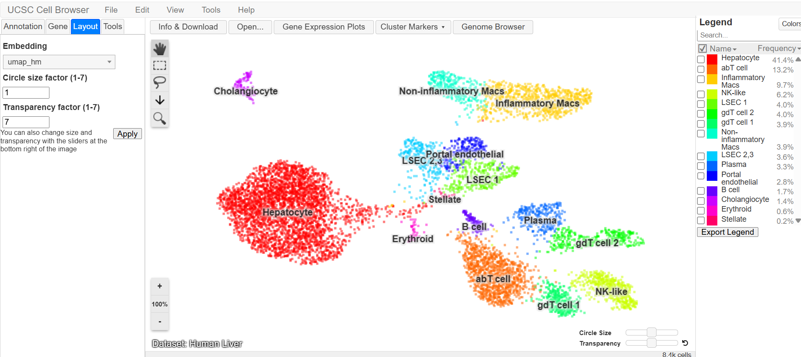
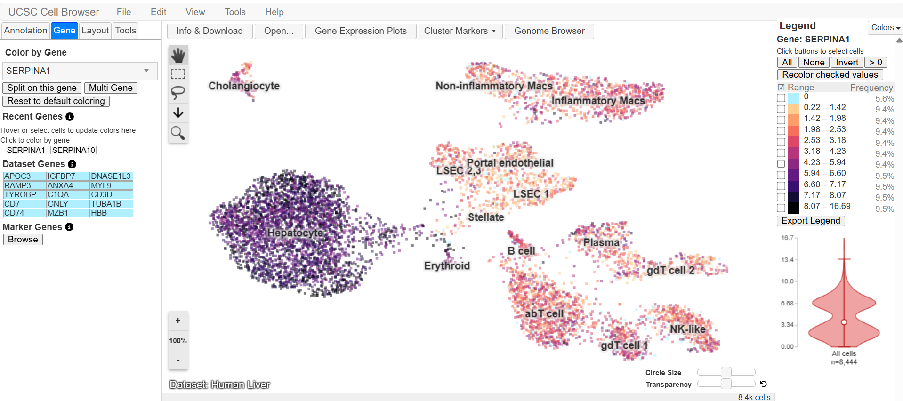
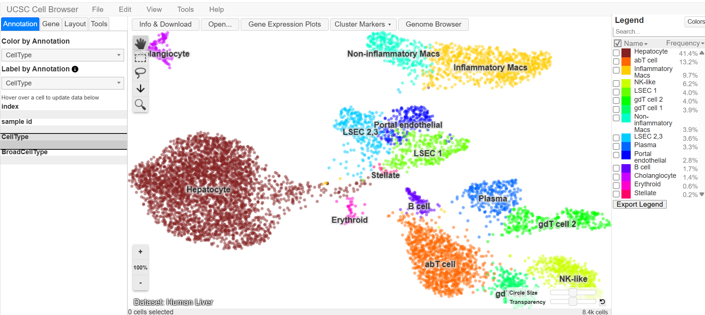
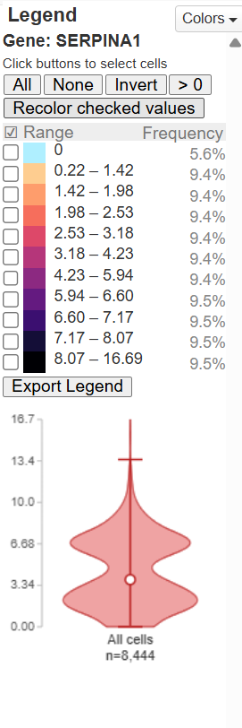
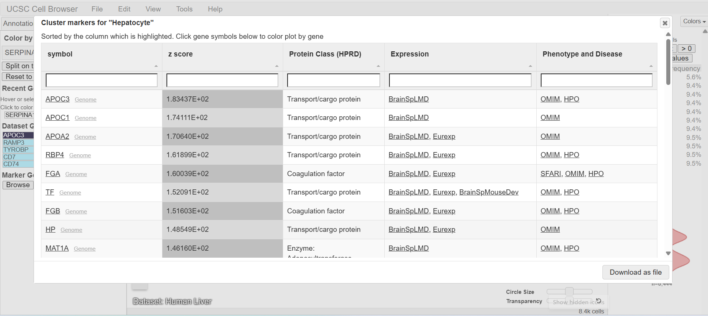

# OBINETA_SERPINA1_UCSC_Genome_Browser
UCSC Genome Browser &amp; ClinVar analysis of SERPINA1, the gene linked to Alpha-1 Antitrypsin Deficiency.

# Exploring a Human Disease Gene Using UCSC Genome Browser and NCBI ClinVar

**Name:** Obiñeta, Inah Marie

**Date Completed:** September 23, 2026

**Assigned Gene:** SERPINA1

**Associated Disease:** Alpha-1 Antitrypsin Deficiency (AATD)

---

## PART A. Create Your GitHub Activity Record

**GitHub Repository Link:**
[https://github.com/iinahmariee/OBINETA_SERPINA1_UCSC_Genome_Browser/tree/GROUP-4](https://github.com/iinahmariee/OBINETA_SERPINA1_UCSC_Genome_Browser/tree/GROUP-4)

---

## PART B. Locate Your Gene in the UCSC Genome Browser

| ITEM | ANSWER |
|---|---|
| a. Official gene symbol | SERPINA1 |
| b. Full gene name | Serpin Family A Member 1 (serpin peptidase inhibitor, clade A [alpha-1 antiproteinase, antitrypsin], member 1) |
| c. Chromosome | 14 |
| d. Assembly | GRCh38.p14 |
| e. Coordinates (GRCh38) | chr14:94,375,355–94,392,044 |
| f. Strand | − (minus strand) |
| g. Approximate size | 13.9 kb |

**Screenshot 1: Gene location in UCSC**

---

## PART C. Understand the Gene Structure: Exons, Introns, and Transcripts

**a. Number of exons you can identify in your selected transcript:**
I selected transcript ENST00000866537.2 (GENCODE V50), visible in the UCSC popup. The tooltip identified this as showing Intron 3 of 5, meaning the transcript has 5 total introns and 6 exons. However, I also checked another transcript, ENST00000866542.2, which UCSC reported as having 5 total exons/4 coding. This shows that exon count can differ between transcripts of the same gene.

**b. Whether multiple transcripts/isoforms are visible:**
Yes. The GENCODE V50 track shows dozens of stacked transcript rows for SERPINA1, indicating many alternative isoforms.

**c. In your own words, explain the difference between an exon and an intron:**
Exons are coding segments kept in the mature mRNA and translated into protein, while introns are non-coding segments spliced out before translation.

**d. Describe whether the introns generally appear longer or shorter than the exons in your gene:**
Introns appear longer than exons in SERPINA1. In the UCSC tooltip, Intron 3 alone measured 1,450 bp, while the exon boxes visible in the browser track are comparatively short and narrow. This matches the general pattern seen in most human genes, where large intron spacers separate relatively small coding exon blocks.

**Screenshot 2: Gene structure (exon boxes, intron connections, transcripts)**

---

## PART D. Turn On and Examine Genome Browser Tracks

**a. Which gene annotation track did you use?**
I used the GENCODE V50 track as my primary gene annotation track, and cross-checked it against RefSeq Curated and MANE Select Plus Clinical — all three consistently labeled the same gene region as SERPINA1.

**b. Were ClinVar-related variant marks visible within or near your gene?**
Yes. After setting the "ClinVar Short Nucleotide Variants < 50bp" track to pack mode and refreshing, numerous individual variants appeared clustered within the gene body, each labeled with its specific nucleotide substitution (e.g., G>A, C>G, A>T, T>C). This is consistent with SERPINA1 being a well-studied, clinically significant gene.

**c. Were some regions more conserved than others?**
Yes. The "100 vertebrates Basewise Conservation by PhyloP" track showed conservation signal that was not uniform across the gene — instead, it appeared as a series of distinct peaks at specific positions, rather than a flat, even level of conservation throughout.

**d. Did conserved regions correspond mainly to exons, introns, both, or another region?**
The conservation peaks appeared to align primarily with the exon boxes in the gene model directly above the track, rather than the intronic connecting regions, consistent with the expectation that protein-coding sequence tends to be under stronger evolutionary constraint than non-coding intron sequence.

**e. In 2-3 sentences, explain why strong conservation can suggest biological importance.**
When a DNA sequence stays nearly identical across species over millions of years, it indicates purifying selection, where harmful mutations in vital regions are continuously removed. This high level of sequence conservation strongly suggests that the region plays a crucial functional role, such as in protein-coding exons or regulatory elements.

**Screenshot 3: Gene with at least one additional track (ClinVar)**

---

## PART E. Select One Variant in NCBI ClinVar

| ITEM | ANSWER |
|---|---|
| Gene | SERPINA1 |
| Variant / HGVS | NM_000295.4(SERPINA1):c.1096G>A (p.Glu366Lys) |
| Common name | "Z allele" / Pi*Z |
| rsID (dbSNP) | rs28929474 |
| GRCh38 position | chr14:94,378,610 |
| Condition | Alpha-1-antitrypsin deficiency (also reported with COPD/emphysema risk) |
| Clinical significance | Reported in ClinVar as Pathogenic (for AATD) / risk factor (for COPD) |
| Review status | Typically "criteria provided, multiple submitters, no conflicts" for this well-studied variant |
| ClinVar record URL | [https://www.ncbi.nlm.nih.gov/clinvar/variation/17967/](https://www.ncbi.nlm.nih.gov/clinvar/variation/17967/) |

**Screenshot 4: Selected ClinVar variant record**

---

## PART F. Find Your Selected Variant Back in UCSC

**a. Where is the variant located relative to your gene?**
The variant (rs28929474, GRCh38 chr14:94,378,610) is located within the coding region of SERPINA1, near the gene's 3′ end.

**b. Is it in an exon, intron, UTR, splice region, or another region?**
Based on its position aligning with one of the dark-blue exon boxes in the GENCODE/RefSeq gene model, the variant falls within an exon rather than an intron.

**c. Is it likely in a coding or non-coding region based on the displayed annotations?**
Coding — the variant is a missense substitution (p.Glu342Lys / p.Glu366Lys depending on transcript numbering), meaning it changes an amino acid in the translated protein, which is only possible if it lies within a protein-coding exon.

**d. Based on its location and ClinVar information, briefly explain how the variant might affect the gene or gene product.**
This Glu-to-Lys substitution introduces a charge clash that destabilizes the folding of alpha-1 antitrypsin. Consequently, the misfolded protein polymerizes in the liver, causing hepatic damage, while lower circulating levels leave the lungs unprotected against elastase.

**e. What additional evidence would be needed before concluding that the variant causes disease?**
Proving causation went beyond genomic location, relying on decades of supporting evidence: functional assays demonstrating impaired protein secretion, family studies linking the variant to disease, low population frequency, and numerous independent case reports. This breadth of validation is reflected in ClinVar's review status, which signals the reliability and consensus level of a variant's classification.

**Screenshot 5: Selected variant in UCSC relative to gene structure**

---

## PART G. Short Reflection

**1. What did UCSC show you about your gene that was not obvious from simply reading about the gene's function?**
UCSC showed the gene's physical structure — a compact 14 kb gene with small coding exons, long introns, and many alternative transcripts. It also revealed how heavily studied SERPINA1 is clinically, with dozens of ClinVar variants clustered in the coding region.

**2. Why is knowing the exact genomic location of a disease-associated variant useful?**
It lets you compare the variant directly against gene models, exon boundaries, and conservation tracks, confirming, for example, that rs28929474 falls inside a coding exon and therefore changes the protein sequence.

**3. What is one limitation of predicting a variant's effect only from its genomic location?**
Location tells you where a variant is, not how harmful it is. Even for this one position, ClinVar showed conflicting classifications (Pathogenic, Likely Pathogenic, and Uncertain Significance), showing location alone isn't enough.

**4. What was the most interesting feature you observed about your assigned gene?**
Seeing alternative splicing directly was the most interesting part. Different transcripts of SERPINA1 had different exon counts (5, 6, or 7), depending on which isoform I checked. It turned a textbook concept into something I could actually see and verify myself.

---

## References and Links

- National Center for Biotechnology Information. ClinVar; [VCV000017967.115], [https://www.ncbi.nlm.nih.gov/clinvar/variation/VCV000017967.115](https://www.ncbi.nlm.nih.gov/clinvar/variation/VCV000017967.115) (accessed September 4, 2026).
- UCSC Genome Browser. *Human GRCh38/hg38, SERPINA1 gene region (chr14:94,376,747–94,390,693)*. Genome Bioinformatics Group, UC Santa Cruz. Retrieved September 23, 2026, from [https://genome.ucsc.edu/cgi-bin/hgTracks?db=hg38&position=chr14:94376747-94390693](https://genome.ucsc.edu/cgi-bin/hgTracks?db=hg38&position=chr14:94376747-94390693)

---

## Submission

- **GitHub repository URL:** https://github.com/iinahmariee/OBINETA_SERPINA1_UCSC_Genome_Browser/tree/GROUP-4
- **Assigned gene:** SERPINA1
- **Selected ClinVar variant:** NM_000295.4(SERPINA1):c.1096G>A (p.Glu366Lys) — rs28929474, "Z allele"
- **Date completed:** September 23, 2026

## PART 2: From Genome to Cell — Exploring a Disease Gene Using the UCSC Cell Browser

**Name:** Obiñeta, Inah Marie

**Date Completed:** September 25, 2026

**Previously assigned gene:** SERPINA1

**Associated disease:** Alpha-1 Antitrypsin Deficiency

---

## Gene Overview

| ITEM | ANSWERS |
|---|---|
| Gene Symbol | SERPINA1 |
| Associated Disease | Alpha-1 Antitrypsin Deficiency |
| Gene Function | Encodes alpha-1 antitrypsin (AAT), a serine protease inhibitor produced primarily by hepatocytes. It protects lung tissue from neutrophil elastase; deficiency leads to unregulated tissue damage (emphysema) and toxic protein accumulation in the liver (cirrhosis). |
| Genome Location | Chromosome 14 (14q32.13) |
| SERPINA1 URL | https://www.ncbi.nlm.nih.gov/gene/5265 |

---

## PART A. Prepare Your GitHub Record

GitHub Repository URL:
https://github.com/iinahmariee/OBINETA_SERPINA1_UCSC_Genome_Browser/tree/GROUP-4

---

## PART B. Open the UCSC Cell Browser and Choose a Dataset

| ITEMS | ANSWER |
|---|---|
| Dataset name | Human Liver |
| Dataset URL | https://cells.ucsc.edu/?ds=human-liver |
| Organ/tissue represented | Liver parenchymal and non-parenchymal cells |
| Relevance to SERPINA1 / Alpha-1 Antitrypsin Deficiency | The liver is the primary organ that synthesizes and secretes circulating alpha-1 antitrypsin. In Alpha-1 Deficiency, misfolded SERPINA1 protein accumulates in hepatocytes, causing liver damage and reducing AAT delivery to the lungs. This dataset directly profiles the cell type responsible for AAT production — biologically the most relevant tissue. |
| Publication/study | MacParland, B. J., et al. (2018). Single cell RNA sequencing of human liver reveals distinct intrahepatic macrophage populations. *Nature Communications*. GEO: GSE115469; PubMed: 30348985. |

**Screenshot 1: 01_dataset.png**

---

## PART C. Understand the Cell Map

| ITEMS | ANSWERS |
|---|---|
| a. Visualization type | UMAP |
| b. What one dot represents | A single human liver cell profiled by single-cell RNA sequencing |
| c. What clusters represent | Distinct liver cell types grouped by similar gene-expression patterns. Axes are mathematical summaries and not physical positions in the organ. |
| d. Three visible cell-type/cluster labels | 1. Hepatocyte 2. Cholangiocyte 3. B cell |

---

## PART D. Search for Your Assigned Gene

| ITEMS | ANSWERS |
|---|---|
| a. Assigned gene symbol | SERPINA1 |
| b. Dataset used | Human Liver |
| c. Expression pattern | Restricted to specific clusters |
| d. Clusters with stronger expression | Hepatocyte cluster, which shows the darkest colors and highest expression values |
| e. Clusters with little/no detectable expression | Cholangiocyte, B cell, abT cell, NK-like, gdT cell, Plasma, Erythroid, Stellate, and all endothelial cell clusters |

**Screenshot 2: 02_gene_expression**

---

## PART E. Identify the Cell Types Expressing Your Gene

| ITEMS | ANSWERS |
|---|---|
| a. Cell type/cluster with strongest visible expression | Hepatocytes |
| b. Another cell type/cluster with detectable expression | Only very faint scattered signal in a small number of non-hepatocyte cells |
| c. Cell type/cluster with relatively low or undetected expression | Cholangiocytes, B cells, abT cells, NK-like cells, endothelial cells. All show negligible to no SERPINA1 expression |
| d. Expression pattern | Highly cell-type restricted |
| e. Biological explanation | According to the data presented on human liver, SERPINA1 encodes a secreted plasma protein produced primarily by hepatocytes, so its strong enrichment in this cluster directly reflects its specialized liver function. Other liver cell types do not specialize in synthesizing this protease inhibitor, explaining why expression is largely absent elsewhere. |

**Screenshot 3: 03_cell_types.png**

---

## PART F. Select Cells and Examine a Violin Plot

| ITEMS | ANSWERS |
|---|---|
| a. Which cells/cluster did you select? | Hepatocyte cluster is the group that shows strongest SERPINA1 expression on the UMAP |
| b. Expression compared to other cells | The selected hepatocytes show markedly higher SERPINA1 expression than all other liver cell types combined. The violin plot peaks are much higher, and the distribution sits far above the background group. |
| c. What the plot adds beyond the UMAP | The UMAP only shows where expressing cells are located spatially. The violin plot reveals the full distribution of expression values and also confirms that nearly all hepatocytes express SERPINA1 at consistently high levels, while non-hepatocyte cells cluster near zero. |

**Screenshot 4: 04_expression_plot.png**

---

## PART G. Explore Marker Genes

| ITEMS | ANSWERS |
|---|---|
| a. Cluster/cell type examined | Hepatocyte |
| b. Marker gene 1 | APOC3 (Apolipoprotein C-III) |
| c. Marker gene 2 | APOC1 (Apolipoprotein C-I) |
| d. Marker gene 3 | APOA2 (Apolipoprotein A-II) |
| e. Does SERPINA1 behave like a cell-type marker? | These markers are specific to hepatocytes, so they clearly identify the cell type. SERPINA1 is also made by hepatocytes but is not unique enough to serve as a defining marker. |

**Screenshot 5: 05_marker_genes.png**

---

## PART H. Compare Your Assigned Gene with One Marker Gene

| ITEMS | ANSWERS |
|---|---|
| a. Assigned disease gene | SERPINA1 |
| b. Marker gene | APOC3 (Apolipoprotein C-III) |
| c. More cell-type-restricted | APOC3 showed intense, nearly exclusive expression in the Hepatocyte cluster; almost no signal elsewhere |
| d. More broadly expressed | SERPINA1 was concentrated in hepatocytes but showed faint scattered signal across a few other cell types |
| e. What this comparison shows | A marker gene like APOC3 is highly specific to one cell type. SERPINA1 is also enriched in hepatocytes but less exclusive. It is functionally important for disease without needing to be a strict cell-type identifier. |

---

## PART I. Connect the Cell Browser Result to Your Previous Genome Activity

**1. Chromosome location**
SERPINA1 is located on the long arm of chromosome 14, specifically at position 14q32.13.

**2. Disease-associated variant examined**
The Z variant (p.Glu342Lys) is the most common severe mutation, for it causes the protein to misfold and accumulate in liver cells instead of being released into the blood. The milder S variant (p.Glu264Val) also reduces functional protein levels.

**3. Cell type(s) expressing the gene**
Hepatocytes are the only cell type with strong, consistent SERPINA1 expression. All other liver cell types show negligible or no detectable expression.

**4. Does this make biological sense?**
Yes, since SERPINA1 makes a protective protein produced mainly by hepatocytes and released into the blood to shield the lungs from damage. In Alpha-1 Antitrypsin Deficiency, misfolded protein builds up in these same hepatocytes and can harm the liver, while too little protective protein reaches the lungs. Seeing expression restricted to hepatocytes directly explains why both liver and lungs are affected by a single gene.

**5. Can this single dataset prove the gene causes the disease?**
No. This dataset only shows where the gene is active in healthy liver cells. It does not compare normal cells to those with the mutation, measure protein function, or link genetic changes to patient symptoms.

---

## PART J. Short Reflection

**1. What did the UCSC Cell Browser show you that the UCSC Genome Browser could not?**
The Cell Browser showed where and how strongly a gene is active across individual cell types and clusters, rather than just its position on the DNA sequence. It revealed that SERPINA1 is almost exclusively expressed in hepatocytes, which the Genome Browser focused on chromosome location, structure.

**2. Why can the same gene have different expression levels among different cell types?**
Every cell shares the same full set of genes, but only a subset are turned on in any given cell type based on its specialized role. Hepatocytes activate genes needed for liver functions including SERPINA1, while other cells silence these genes and express their own unique sets instead.

**3. Why should you be careful when interpreting a gene that shows zero or very low expression in single-cell data?**
A zero or near-zero reading does not always mean the gene is completely absent or inactive. It may simply be too rare to detect reliably in that cell. Technical limits, low sequencing sensitivity, or timing of expression can also hide true biological signal, so results should be interpreted cautiously.

**4. Why is it useful to combine information about genomic location, genetic variants, and cell-specific gene expression?**
Knowing where a gene sits in the genome, what variants it carries, and exactly which cells express it creates a complete picture from DNA change to biological effect. These layers help explain how a mutation in a liver-specific gene can cause both liver and lung disease, and why symptoms appear in some tissues but not others.

**5. What was the most interesting observation you made about your assigned gene?**
I was surprised to see how strictly SERPINA1 is limited to hepatocytes, even though the disease it causes damages both the liver and the lungs. The realization that since the protein is made in the liver but travels through the blood to protect the lungs and is connecting where the gene is expressed to where the illness appears.

---

## References

National Center for Biotechnology Information. (n.d.). *SERPINA1 serpin family A member 1 [Homo sapiens (human)]* (Gene ID: 5265). U.S. National Library of Medicine. Retrieved September 25, 2026, from https://www.ncbi.nlm.nih.gov/gene/5265

UCSC Cell Browser. (n.d.). *Human Liver dataset: Hepatocyte cluster view* [Data set]. University of California, Santa Cruz. Retrieved September 25, 2026, from https://cells.ucsc.edu/?ds=human-liver&col_Hepatocyte=842222

UCSC Cell Browser. (n.d.). *Human Liver dataset: SERPINA1 gene expression view* [Data set]. University of California, Santa Cruz. Retrieved September 25, 2026, from https://cells.ucsc.edu/?ds=human-liver&gene=SERPINA1

---

## Submission

- **GitHub repository URL:** https://github.com/iinahmariee/OBINETA_SERPINA1_UCSC_Genome_Browser/tree/GROUP-4
- **Assigned gene:** SERPINA1
- **Date completed:** September 25, 2026
